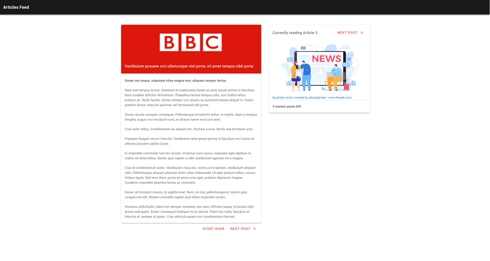
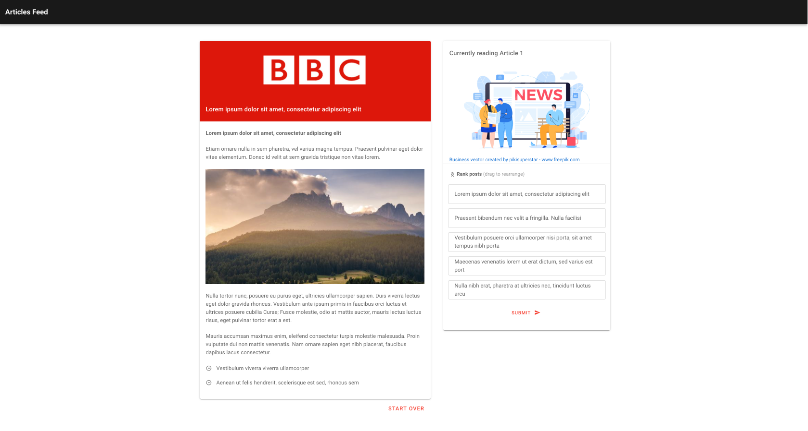
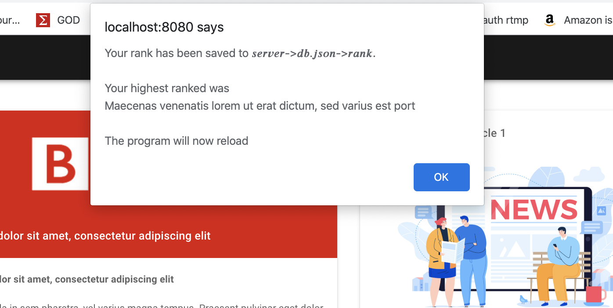

# Articled Feed

An application that allows reading and ranking of posts which are generated randomly

## Run application

SERVER
```
cd server && yarn start
```

APP (new terminal)

```
yarn serve
```

#### Production
```
yarn build
```

## Tests

```
yarn test:e2e
```

## Tools & Packages
vuejs | vuetify | json-server | vue.draggable | uuid | cypress

## Screenshots
(Window has been zoomed out to accomodate all contents)



